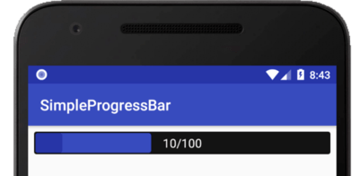
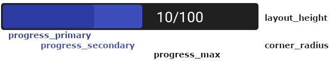

# Simple Progress Bar for Android


This library provides an easy to use progress bar with a secondary progress on it, which is useful for
displaying intermediate level progress.

## How to use
### Import with gradle
1. Add **jitpack.io** in your root *build.gradle* at the end of repositories:

	```groovy
    allprojects {
        repositories {
            ...
            maven { url 'https://jitpack.io' }
        }
    }
	```
2. Add SimpleProgressBar dependency:
	```groovy
    dependencies {
        implementation 'com.github.C0d3GGz:android-SimpleProgressBar:-SNAPSHOT'
    }
	```

### Add manually
1. Clone or download this repository
2. Build library
2. Copy files into libs directory in your app folder
    1. for \*.jar files: add this code to dependency on your gradle file
    2. for \*.aar files: try from projectstructure / new module/ import from aar/jar

```groovy
compile files('libs/library.jar')
```

### Create SimpleProgressBar
You can define the SimpleProgressBar both with xml and programmatic as in the following explained.
#### xml
Specify the *app* namespace for your layout by adding `xmlns:app="http://schemas.android.com/apk/res-auto"`. Define the colors `colorPrimary` for primary, `colorSecondary` for secondary progress and `backgroundDefault` for the background color. You can as well change the inside padding with the `app:padding` element which in this example is set to `2dp`.


```xml
<de.thkoeln.simpleprogressbar.SimpleProgressBar
        android:id="@+id/myCustomProgressbar"
        app:progress_primary="10"
        app:progress_secondary="40"
        app:progress_max="100"
        android:layout_width="0dp"
        android:layout_height="30dp"
        android:layout_marginEnd="8dp"
        android:layout_marginStart="8dp"
        android:layout_marginTop="8dp"
        app:corner_radius="3dp"
        app:layout_constraintEnd_toEndOf="parent"
        app:layout_constraintStart_toStartOf="parent"
        app:layout_constraintTop_toTopOf="parent"
        app:padding="2dp" />
```
#### programmatic
```java
myCustomProgressbar.bgColor = ContextCompat.getColor(this, R.color.colorAccent)
myCustomProgressbar.primaryColor = ContextCompat.getColor(this, android.R.color.holo_blue_bright)
myCustomProgressbar.secondaryColor = ContextCompat.getColor(this, android.R.color.holo_blue_dark)
myCustomProgressbar.primaryProgress = 10
myCustomProgressbar.secondaryProgress = 40
myCustomProgressbar.maxProgress = 100
```
